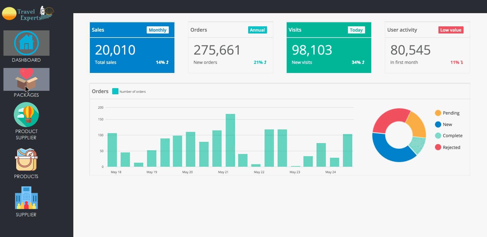

# Travel Experts Application

A Desktop Application to administer data for a travel agency. Data stored on the database can be administered using this application where users will be able to view and modify the data.

## Before using
Application must connect to Travel Experts Database in MSSQL. Run the sql script included (travelexperts.sql)

## Take A Peak

</img>

### Search

</img>

### Update

</img>

## Built With

* LANGUAGE: C#
* DATABASE: MSSQL

## Authors

* **Louise Acosta** 
* **Daniel Hu** 
* **Ibraheem** 

